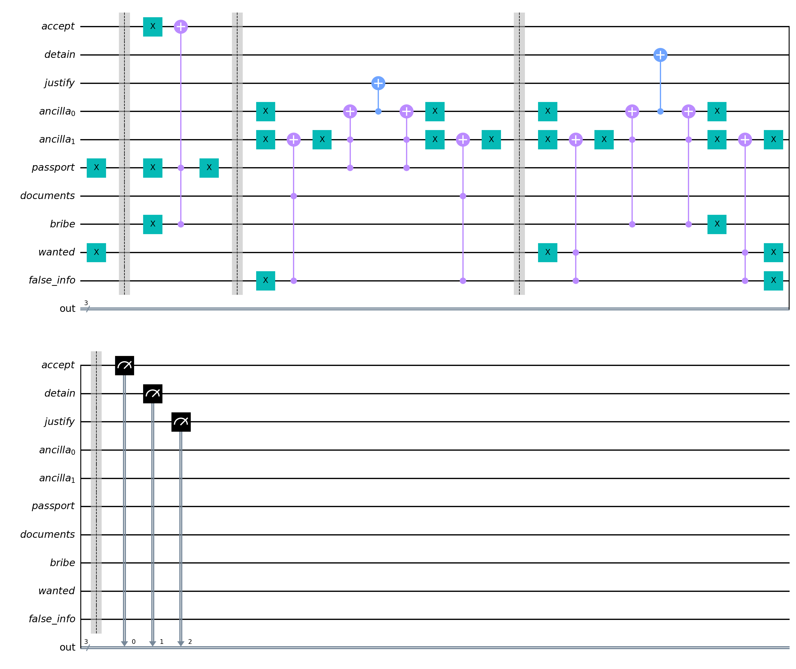
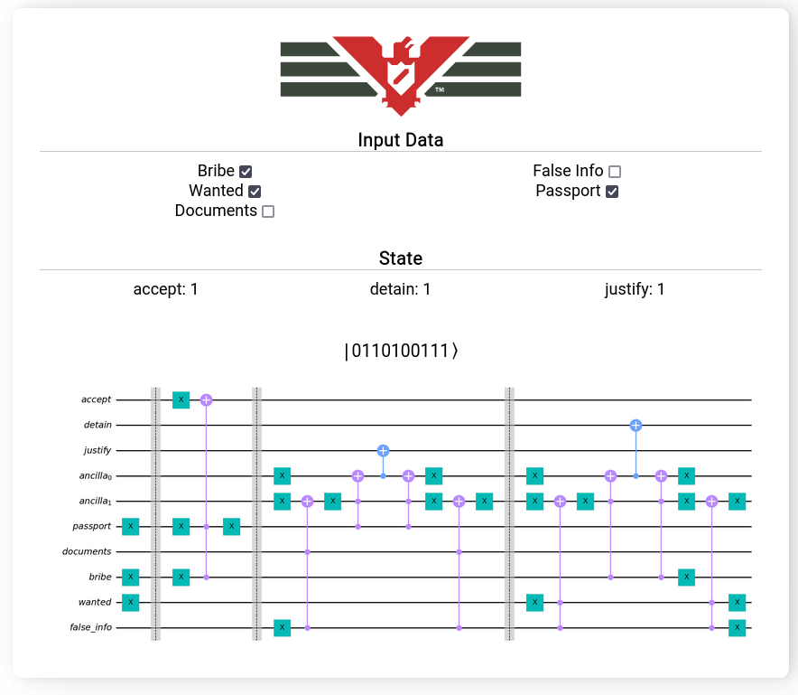
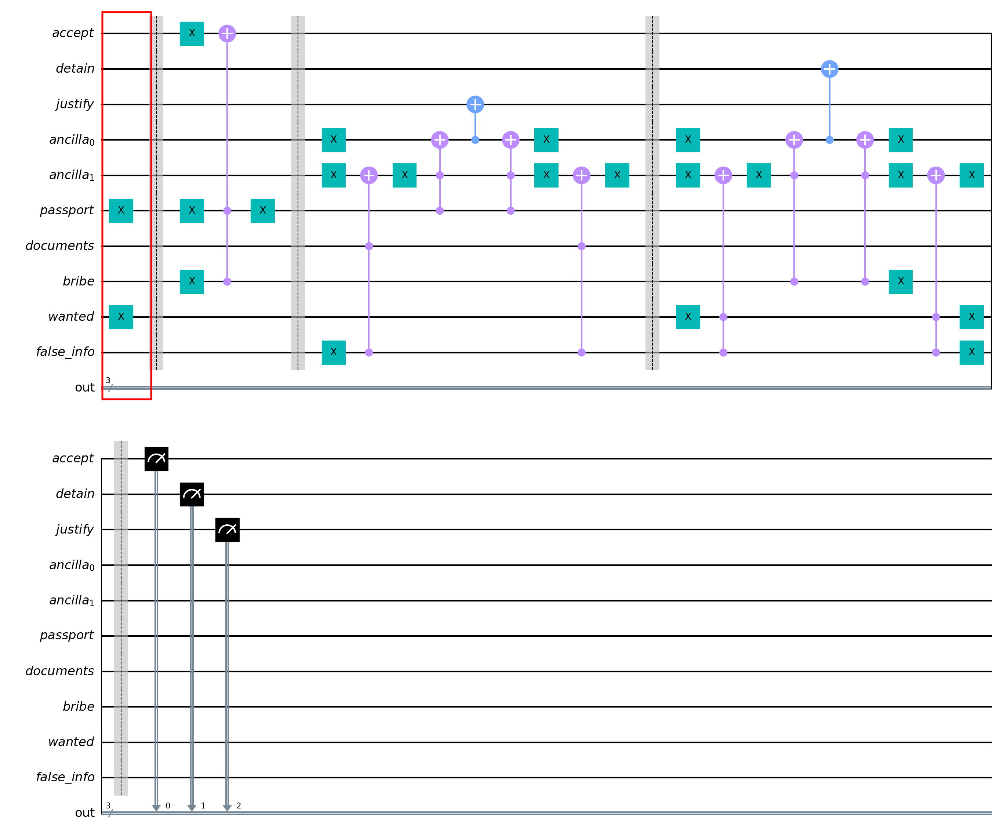
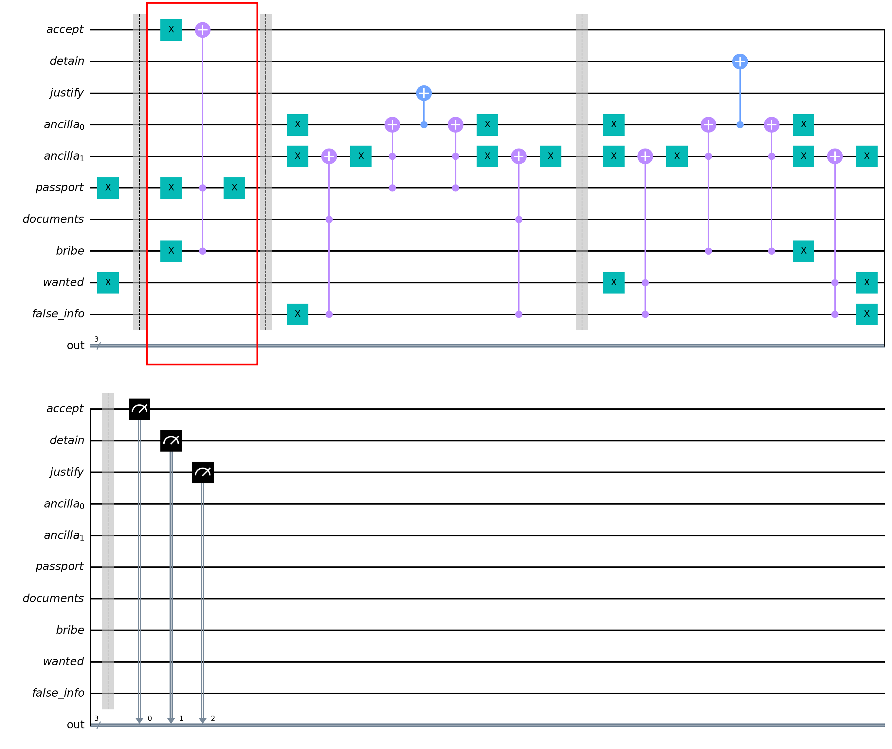
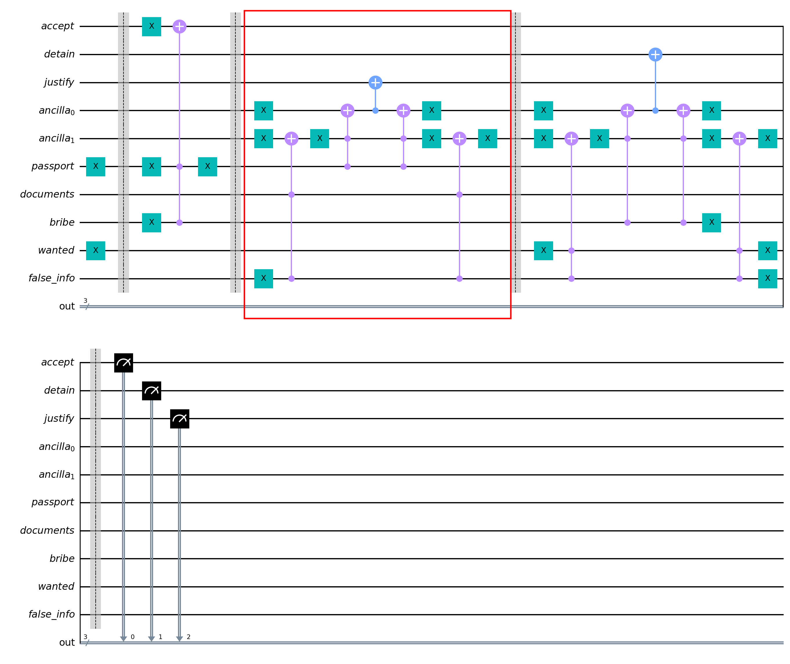
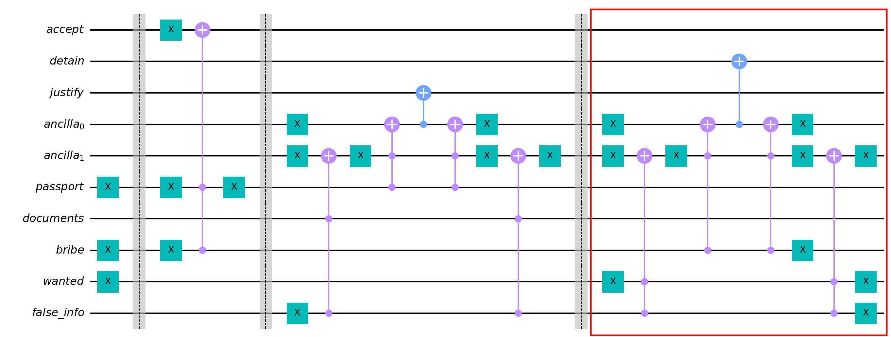
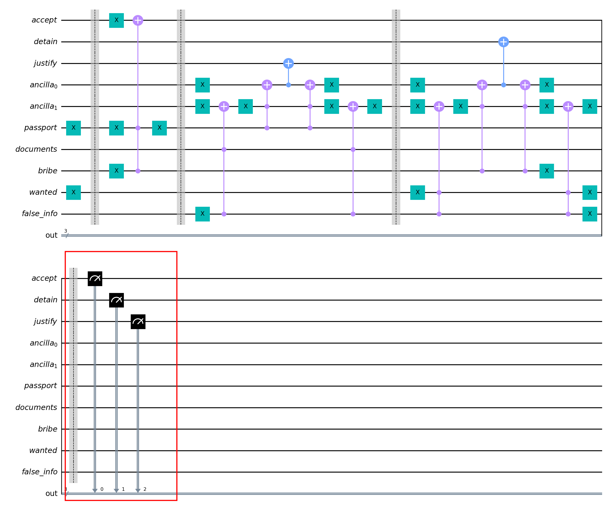

# QPapersPlease
This project, is a quantum algorithm to say if a immigrant can `pass`, `be detained` and/or `be declined with a justification`.

The algorithm itself is a qiskit circuit, that you can see [in the notebook file](./papers-please.ipynb).




However, I've created a web version, which you can run locally and test the different inputs and outputs the algorithm can return.



## Algorithm

The algorithm is based on the mechanics of the game but, to make this algorithm smaller: 
* `false_info` represents any false information in any documents
* `documents` represents all other required documents like: (citizen ID, entry pass, worker pass, etc.)

`Note: If you don't recognize any of these information from the game, I really recommend you to play or see some gameplays, it's worth it.`

So first, we encoded the input data in form of `x` gates when we want to flip `0 --> 1` or `false --> true` in the first section.


After that, we check if the immigrant can be accepted, so we check if he has the `passport` or if he's trying to `bribe`, if any of these are true, the accept become true.


 
Then, we check if there're false information and are missing documents (including passport). If it's true, the justify qubit become also true.



In the last step, we check if we can detain the person, so we check if there're false information, if the person is wanted and if he's trying to bribe us. If it's true, the detain qubit become true.



To get the result, we measure the accept, detain and justify qubit in this order:

$|${justify}{detain}{accept}$⟩$




## Running

### Requirements
* [Python (3.7.5)](https://www.python.org/downloads/)
* [Nodejs (18.14.0)](https://nodejs.org/en/download)
* [pnpm](https://pnpm.io/)
* [pipenv](https://pipenv.pypa.io/en/latest/)


### RUN Jupyter notebook

To run the algorithm notebook:

```bash
pipenv install
pipenv shell
jupyter-lab
```


### RUN Website

To run the website:

```bash
#backend First
cd ./backend/
pipenv install
pipenv shell
flask --app web run

#frontend
cd ..
cd ./frontend/
pnpm install
pnpm dev
```

## Copyright

This is a just a fan made project.

All Rights reserved to the creators of the game. If you can, please, support them: [papers please website](https://papersplea.se/).

---

Made with 🥰 by [Dpbm](https://github.com/Dpbm)
